author: Antonio Peñalver Caro
id: Máquina Easy Peasy
categories: Hacking Ético
environments: Web
status: Published

# Máquina: EasyPeasy

**Tryhackme: Easy Peasy**

**Nota:** La máquina soltó la IP que estaba usando (10.10.119.179) a mitad del trabajo y tuve que pedir una IP nueva (10.10.157.68).

Lo primero que nos pide la prueba, es que comprobemos cuántos puertos tiene abiertos la máquina a vulnerar.

Para ello, utilizaremos el comando “NMap” con la siguiente sintaxis:

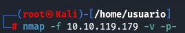

En este caso, la salida del comando nos muestra que existen 3 puertos TCP abiertos.

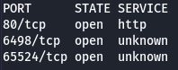

Ahora lo que nos pide, es saber cuál es la versión del servidor “nginx” que supuestamente está corriendo en la máquina a vulnerar.

Para ello, utilizaremos también el comando “NMap” con la siguiente sintaxis para hacer una búsqueda más exhaustiva de los servicios que encontramos anteriormente y de sus respectivas versiones.

**Nota:** En la imagen que sigue utilizo la dirección IP que me dio después la página porque tuve que seguir el ritmo de la clase y me quedé sin hacer lo de las versiones.

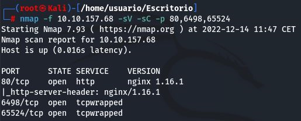

Como se observa en la imagen anterior, la versión que se está utilizando de nginx, es la 1.16.1.

En la última pregunta de la primera parte de la prueba, nos preguntan: ¿Qué está corriendo detrás del puerto más alto? (El 65524)

Para comprobar esto, nos iremos al navegador de nuestra máquina y colocaremos lo siguiente en el buscador de URLs:

[http://10.10.157.68:65524](http://10.10.157.68:65524/)

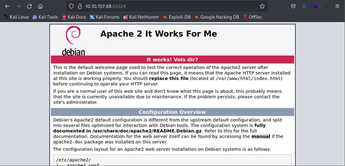

Como se observa en la imagen anterior, lo que está corriendo detrás del puerto 65524, es un servidor web Apache.

Lo que haremos a continuación, será indagar un poco en los directorios que estén detrás de esta dirección web:

[http://10.10.157.68](http://10.10.157.68/)

Para ello, utilizaremos la herramienta “GoBuster”, la cual nos ayudará a realizar lo comentado anteriormente.

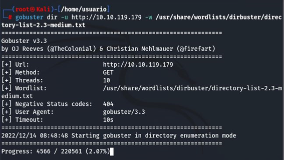

El diccionario que ha sido utilizado en la imagen anterior, es uno predeterminado de la herramienta “DirBuster”, el cual se encargará de realizar la fuerza bruta sobre los directorios que estén dentro de la URL anterior.

Al rato de haber lanzado el comando anterior, GoBuster nos mostrará un directorio llamado “Hidden”.

A continuación, lo que haremos será acceder a dicho directorio para ver qué hay en el interior del mismo:

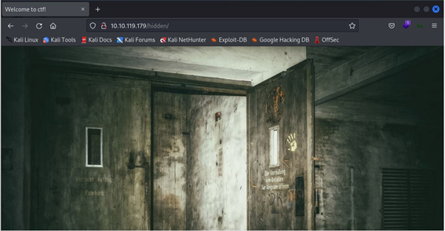

Como se observa en la imagen anterior, lo que nos devuelve ese directorio es una imagen.

Pero como lo que queremos saber, es si hay información importante detrás de todo, lo que tenemos que hacer es acceder al código fuente de dicha página y buscar si hay algo relevante para poder seguir vulnerando la máquina atacada:

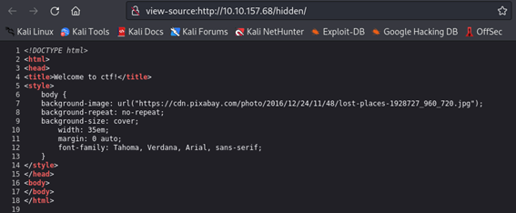

Como se observa en la imagen anterior, no hay nada relevante.

**Obtención Primera Flag**

Para obtener la primera flag, lo que haremos a continuación, será aplicar el comando de GoBuster que utilizamos anteriormente, pero con el directorio “Hidden”:

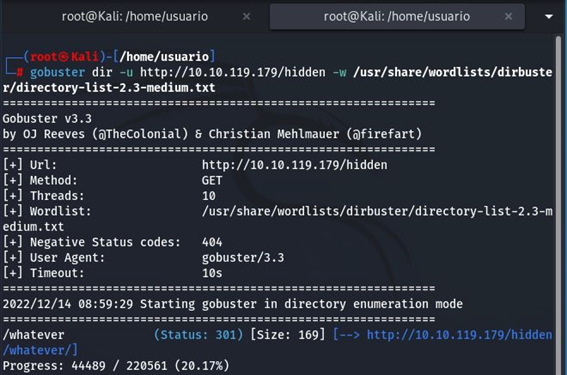

Como se observa en la imagen anterior, la salida del comando muestra un subcarpeta dentro de “Hidden” que se llama “Whatever”. Entonces, lo que vamos a realizar a continuación, es entrar en dicha carpeta para ver si alberga algo de información en ella.

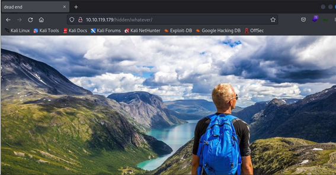

Como se observa en la imagen anterior, la subcarpeta “Whatever” devuelve una imagen. Entonces, lo que vamos a hacer ahora, es entrar dentro del código fuente de dicha página para ver si esta vez encontramos algo con lo que podamos seguir comprometiendo a la máquina atacada:

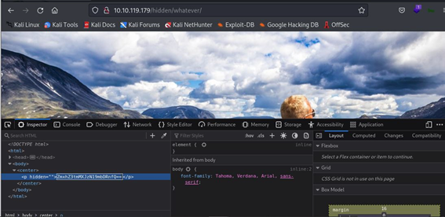

Como se observa en la imagen anterior, existe un párrafo oculto con información en su interior. Por los dos caracteres “=” que se sitúan al final de la información, se podría llegar a pensar de que la información está codificada en “Base64”. Por lo tanto, lo que vamos a hacer a continuación, es comprobar si efectivamente dicha información está codificada en “Base64”:

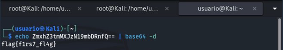

La salida del comando, nos muestra como resultado el código de la primera flag de la prueba.

**Obtención Segunda Flag**

Para la obtención de la segunda flag, lo que vamos a hacer es acceder al fichero “Robots.txt”  que se encuentra alojado en la siguiente dirección web:

[http://10.10.157.68:65524/robots.txt](http://10.10.157.68:65524/robots.txt)

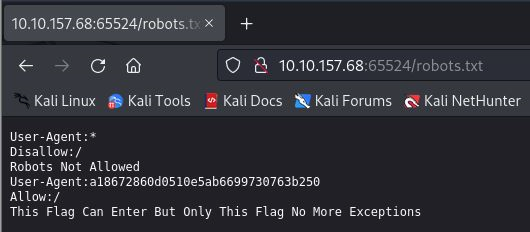

En la imagen anterior, viene una frase que dice:

**Esta bandera puede entrar, pero solo esta bandera sin más excepciones.**

Por lo que nos está dando una pista de que la bandera se puede encontrar en dicho fichero.

En la imagen, en el apartado “User-Agent”, se ve que hay un texto aparentemente codificado. Para saber si es una posible pista, para quitarnos de dudas vamos a utilizar una herramienta muy buena llamada “Hash-Identifier” para ver si nos dice algo acerca de dicho texto:

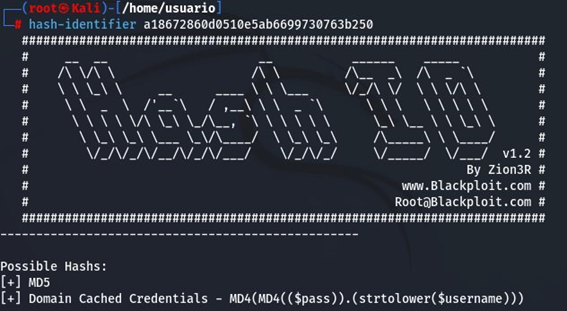

La salida del comando, nos muestra que el texto está posiblemente hasheado en MD5. Así que lo que vamos a hacer a continuación, es descifrar dicho texto utilizando una página de internet:

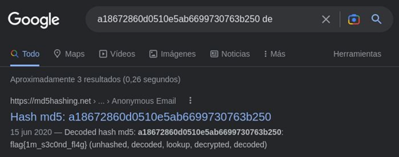

Como se observa en la imagen anterior, el resultado de la decodificación del texto, es el código de la segunda bandera de la prueba. Por lo tanto, ese texto si era una pista para poder seguir vulnerando la máquina.

**Obtención Tercera Flag**

La tercera bandera, es la más fácil de descubrir, ya que se encuentra escrita en texto plano en el código fuente de la siguiente URL:

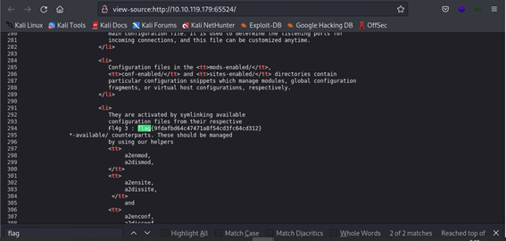

En el mismo código fuente, hay una línea que contiene un texto oculto que dice:

**Está encodeado con ba…:(Información cifrada)**

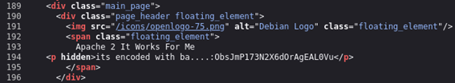

Como dicha información tiene pinta de ser una pista, vamos a intentar descifrarla para ver si nos proporciona algo interesante sobre la máquina que estamos vulnerando.

Haciendo alguna que otra búsqueda por internet, encontraremos que dicha información está cifrada en “Base62”, por lo tanto, procederemos a descifrarla con dicho método.

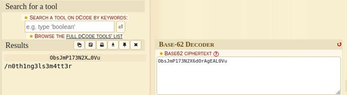

Como se observa en la imagen anterior, la información descifrada nos proporciona el acceso a un posible directorio. Entonces, nos vamos a dirigir el navegador y vamos a introducir la siguiente dirección web para ver si este nos arroja algo de información:

La imagen anterior nos devuelve una imagen estilo Matrix. Pero como lo que nos interesa, es seguir encontrando medios para seguir vulnerando la máquina, accederemos al código fuente de dicha página para ver si encontramos algo interesante:

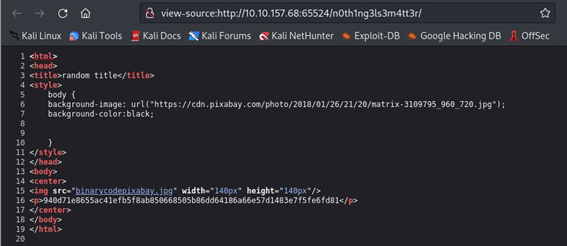

En la captura anterior, podemos ver la URL donde se aloja la imagen que se nos ha mostrado anteriormente, pero si nos fijamos un poco más abajo, hay otra imagen registrada y un párrafo con información aparentemente codificada.

Lo que vamos a hacer, es coger primero esa información y la vamos a introducir en un fichero de texto. Posteriormente, nos vamos a descargar el diccionario que se nos proporciona en la plataforma de la prueba y vamos a intentar ver si dicha información está relacionada con algún tipo de contraseña.

Para ello, utilizaremos la herramienta “John The Ripper” con la siguiente sintáxis:

John --wordlist=(NombreDiccionario) --format=gost (NombreFichero)

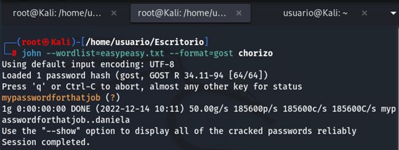

Como puede observar en la captura anterior, la herramienta nos ha sacado una contraseña perteneciente a una tal Daniela.

Ahora cogeremos la segunda imagen que nos encontramos en el código fuente y la descargaremos para ver si encontramos algo en ella:

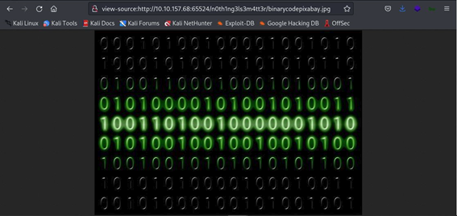

Para ello, utilizaremos el comando “Steghide” con la siguiente sintaxis:

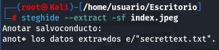

Como se puede observar en la captura anterior, la salida del comando utilizado nos ha devuelto un fichero de texto llamado “secrettext.txt”.

Si le realizamos un “Cat” al fichero sacado, nos mostrará la siguiente información:

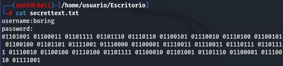

Dicho fichero contiene el usuario y la contraseña escrita en binario de un usuario del sistema.

Para poder sacar la contraseña, tendremos que hacer una pequeña búsqueda en Google de un decodeador de binario:

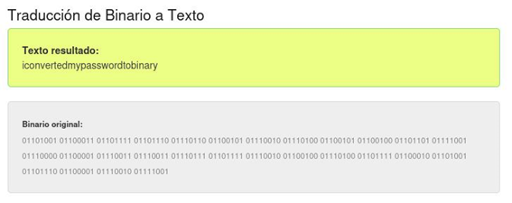

Ahora que tenemos el usuario y contraseña, nos vamos a conectar por “SSH” a la máquina vulnerada a través de uno de los puertos que nos encontramos al principio en el escaneo (6498):

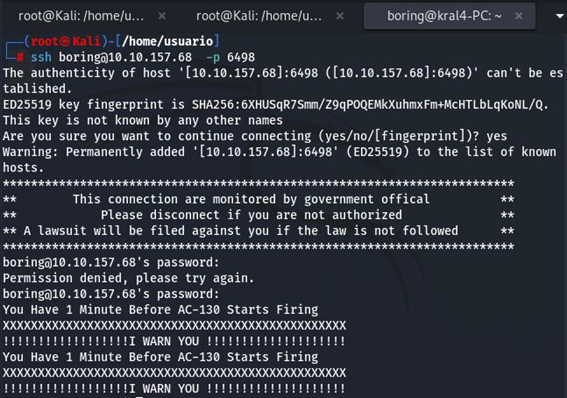

Con esto, ya estaríamos dentro de la máquina como si fuésemos el usuario “boring”.